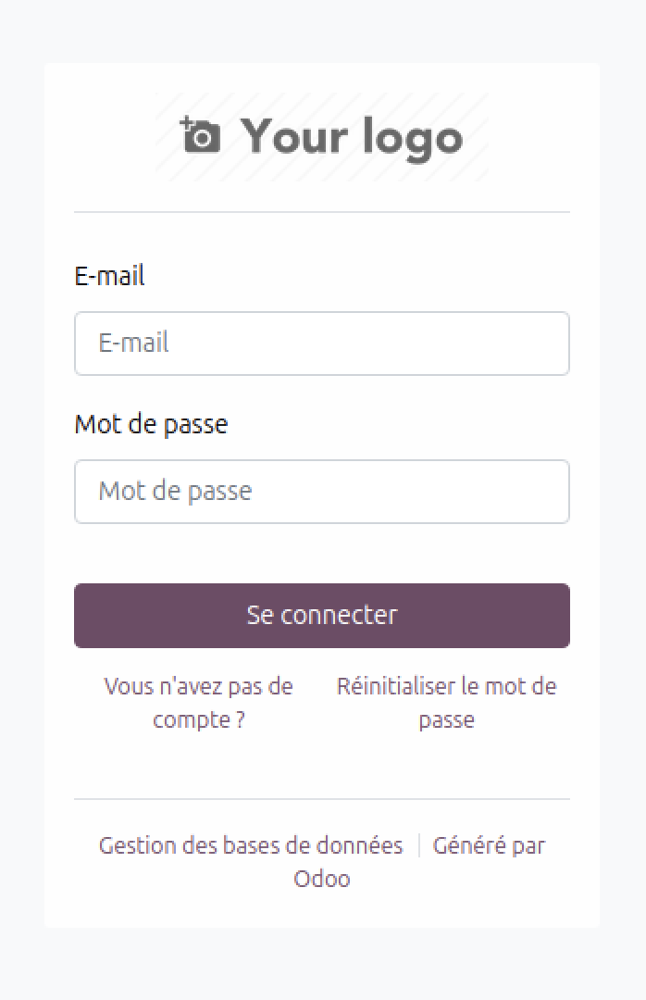
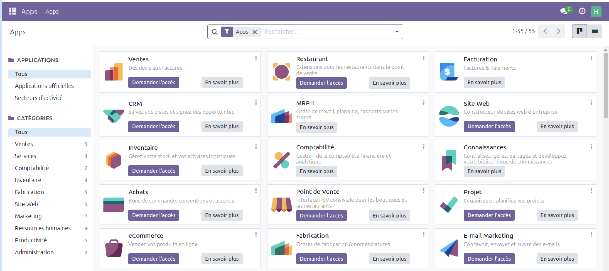
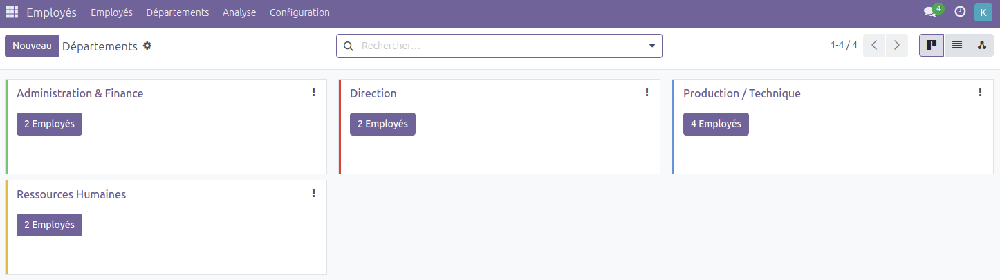
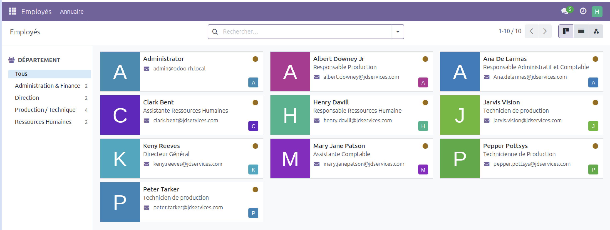
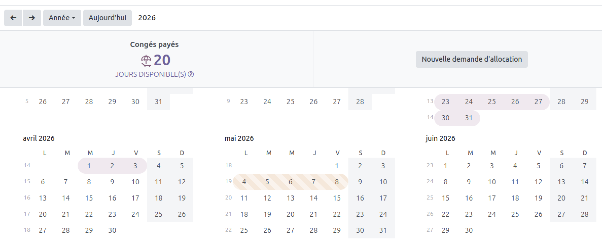
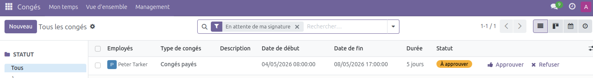
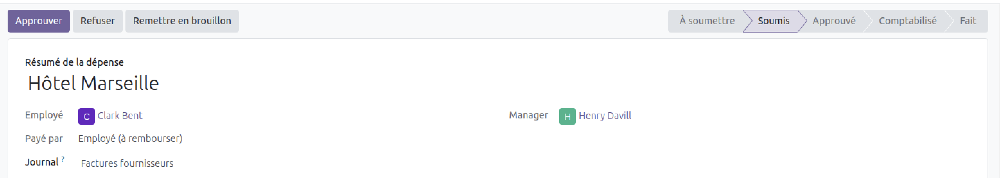
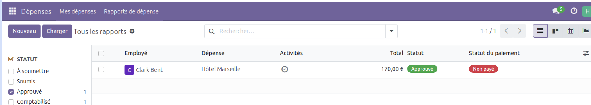

# 📂 Projet – ERP RH avec Odoo

## Objectif du projet

Dans le cadre de ma reconversion vers un poste de **Support Applicatif / Consultant ERP**,  
ce projet a pour objectif de :

- Installer et configurer un ERP open-source
- Créer une base RH fonctionnelle
- Préparer un environnement pour le développement de modules custom
- Documenter l’ensemble du projet

ERP utilisé : **Odoo 17 Community**

## **Vous trouverez des captures d'écran du projet dans le détail des étapes ci-dessous.**

# Étapes réalisées jusqu’à présent

- [x] Installation Docker Odoo
- [x] Création de la société
- [x] Création des employés
- [x] Création des utilisateurs
- [x] Configuration hiérarchie RH
- [x] Configuration des congés
- [x] Test du workflow des congés
- [x] Configuration des notes de frais
- [x] Test du workflow des notes de frais
- [x] Module Recrutement
- [ ] Dashboard RH (à venir)
- [ ] Custom module Odoo (à venir)

## Détail des étapes

## 1️. Préparation de l’environnement

- OS : Linux
- IDE : VS Code
- Docker : version 28.1.1
- Docker Compose : version v2.35.1

## 2. Scripts d’automatisation Docker

Afin de simplifier la gestion de l’environnement Odoo, deux scripts Bash ont été créés pour automatiser le démarrage et l’arrêt du projet.

---

## 3. Créer l’entreprise fictive dans Odoo

## 4. Installer les modules RH essentiels

- Employés
- Congés
- Recrutement
- Notes de frais

## 5. Créer la structure organisationnelle

J'ai crée 4 départements où je peux ensuite affecter les employés :

- Direction
- Ressources Humaines
- Production / Technique
- Administration & Finance

## 6. Créer les rôles clés et les employés

J'ai créé des employés que j'ai ensuite assigné à un département et un manager :

| Employé                | Département                      | Manager                |
| ---------------------- | -------------------------------- | ---------------------- |
| DG                     | Direction                        | —                      |
| Responsable RH         | RH                               | DG                     |
| Responsable Production | Production                       | DG                     |
| Comptable              | Administration                   | DG                     |
| 5 salariés             | Production / Administration / RH | Manager du département |

J'ai ensuite vérifié que les workflows de validation (congés, notes de frais) sont correctement liés à la hiérarchie.

## 7. Création des utilisateurs liés aux employés

Pour que les workflows RH fonctionnent correctement (congés, dépenses, etc.), chaque employé fictif a été **lié à un utilisateur Odoo**.

- Les utilisateurs ont été créés **via le compte Admin**.
- En l'absence de serveur mail sur l’environnement local, les mots de passe ont été **définis manuellement** pour chaque utilisateur.

Exemple de comptes créés :

| Employé                    | Département              | Rôle                   | Email utilisateur         |
| -------------------------- | ------------------------ | ---------------------- | ------------------------- |
| Keny Reeves                | Direction                | Directeur Général      | prenom.nom@jdservices.com |
| Henry Davil                | RH                       | Manager RH             | prenom.nom@jdservices.com |
| Albert Downey Jr           | Production               | Chef d’équipe          | prenom.nom@jdservices.com |
| Ana De Larmas              | Administration & Finance | Responsable Comptable  | prenom.nom@jdservices.com |
| Pepper Pottsys             | Production               | Technicien             | prenom.nom@jdservices.com |
| Peter Tarker               | Production               | Technicien             | prenom.nom@jdservices.com |
| Mary Jane Patson           | Administration           | Assistant              | prenom.nom@jdservices.com |
| Clark Bent                 | RH                       | Assistant RH           | prenom.nom@jdservices.com |
| (recrutement) Bruce Wayner | Ventes                   | Responsable commercial | prenom.nom@jdservices.com |
| (recrutement) Nick Grayson | Ventes                   | Commercial B2B         | prenom.nom@jdservices.com |

> Résultat : l’environnement Odoo est prêt pour tester les workflows multi-utilisateurs (demande de congé, validation, dépense, etc.).

## 8. Réaliser un workflows des congés + Test fonctionnel

### Effectuer l'allocation de congés

Depuis le compte admin :

- J'ai créé et configuré un nouveau type de congé "Congés payés"
- J'ai attribué à ce type de congé une validation à 1 niveau, celui du manager.
- J'ai attribué à chaque salarié 25 jours de CP
- Chaque employé possède alors un solde de congés disponible.

### Simulation avec un salarié

- Connexion depuis le compte d'un "technicien de production" sous la direction du responsable de production.
- Création d'une demande de congés de 5 jours
- Résultat : Le solde de CP de l'employé passe de 25 jours à 20 jours
- Le demande est "en attente" de validation

- Connexion depuis le compte du Responsable de Production.
- La manager voit bien la demande de congé de son salarié.
- Il peut approuver ou refuser la demande.

### Elèments configurés

- [x] la hiérarchie des employés

- [x] les utilisateurs

- [x] les droits d'accès

- [x] les types de congés

- [x] les allocations de congés

- [x] le workflow de validation

## 9. Réaliser une gestion des notes de frais + Test fonctionnel

### Workflow mis en place

Le processus :

Employé  
→ Création d'une note de frais  
→ Soumission de la demande

Manager  
→ Vérification de la demande  
→ Validation de la note de frais

### Simulation réalisée

Une simulation de déplacement professionnel avec :

- une dépense **Hôtel**
- une dépense **Repas professionnel**

--> La demande est transmise automatiquement au manager pour validation.

- Résultat : Configuration permetant de reproduire un processus de gestion des dépenses professionnelles, avec un workflow de validation hiérarchique.

## 10. Réaliser des recrutements via le module recrutement

Simulation d'un processus complet de recrutement :

- création d'un nouveau département (Ventes)
- recrutement d'un Responsable commercial
- structuration du département
- recrutement d'un Commercial B2B rattaché au manager

Le processus permet de transformer un candidat en employé directement dans l'ERP, puis de l'associer directement à un utilisateur et de créer ses identifiants (email, mot de passe).

---

### start.sh — Démarrage de l’environnement

Ce script permet de :

- Lancer les conteneurs Docker (`odoo_app` et `odoo_db`)
- Vérifier que les deux services sont bien actifs
- Afficher un message de confirmation
- Fournir le lien d’accès à l’application

### stop.sh — Arrêt de l’environnement

Ce script permet de :

- Arrêter proprement les conteneurs
- Libérer les ressources système
- Conserver les données (volume PostgreSQL intact)

### Pourquoi Docker ?

- Isolation complète de l’environnement
- Reproductibilité : la même configuration peut être relancée sur n’importe quelle machine
- Stabilité : choix de versions validées par Odoo (PostgreSQL 15, Odoo 17)
- Permet de développer et tester des modules sans affecter le système hôte
